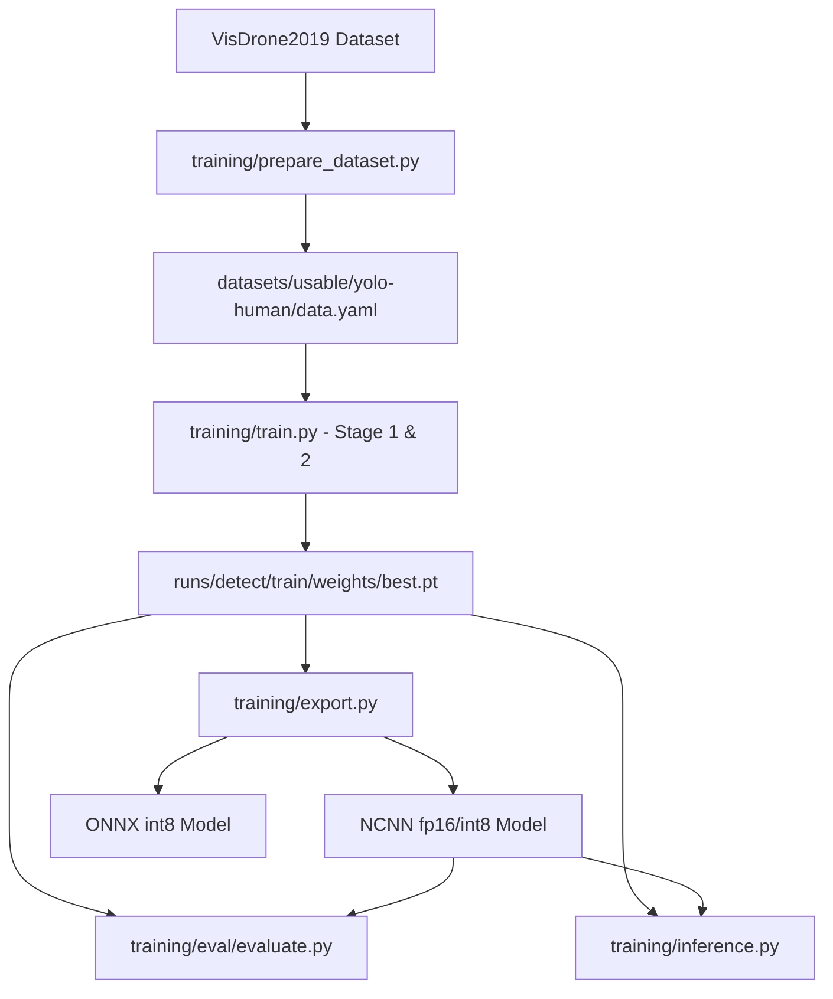

# Repository Guidelines

## Project Overview

`rescue-swarm` is an end-to-end computer vision ML engineering pipeline designed for real-time human detection from aerial drone footage. The repository fine-tunes **YOLO11n** models on the VisDrone2019-DET dataset, quantizes and exports models (NCNN/ONNX fp16/int8) for low-power edge deployment on a **Raspberry Pi 5** (targeting $\ge 15$ FPS throughput on ARM Cortex-A76), and provides a hardware-constrained evaluation suite for local performance benchmarking.

## Architecture & Data Flow

The codebase is structured around a sequential model lifecycle:

1. **Dataset Pipeline** (`training/prepare_dataset.py`): Converts raw VisDrone2019-DET bounding box annotations (`x, y, w, h` in absolute pixels) into normalized YOLO format (`x_center, y_center, width, height` in $0..1$). Filters VisDrone classes `1` (pedestrian) and `2` (people) into single class `0: human` (ignoring category `0` ignored regions and non-human classes). Outputs dataset split directory and `data.yaml`.
2. **Model Training** (`training/train.py`): Fine-tunes `yolo11n.pt` using Ultralytics YOLO. Supports a two-stage fine-tuning strategy (Stage 1 with backbone frozen `--freeze 10`; Stage 2 full fine-tuning with `--freeze 0` and `--cos-lr`). Employs `--batch -1` auto-batching to operate within restricted host GPU VRAM (~4 GB).
3. **Model Quantization & Export** (`training/export.py`): Converts trained PyTorch weights (`.pt`) to NCNN (fp16/int8) optimized for ARM NEON instructions or ONNX (int8) for edge execution.
4. **Video Inference Engine** (`training/inference.py`): Streams video frames or live webcam input (`--input 0`), executes frame-by-frame detection across `.pt`/NCNN/ONNX formats, measures moving-average FPS, and renders annotated bounding boxes using OpenCV.
5. **Edge Simulation & Benchmarking** (`training/eval/evaluate.py`): Replicates Raspberry Pi 5 resource limits on laptop hardware (`CUDA_VISIBLE_DEVICES=-1`, 4 CPU thread limit, 4 GB RAM RSS threshold, and `--rpi-factor 0.55` latency scaling multiplier) to measure accuracy (mAP50, mAP50-95) and latency sweeps across input resolutions (e.g. 640, 416, 352).



## Key Directories

- `training/`: Core pipeline scripts for dataset preparation, training, export, video inference, and visualization.
- `training/eval/`: Hardware-constrained Raspberry Pi 5 evaluation harness (`evaluate.py`) and benchmarking documentation (`README.md`).
- `datasets/`: Local storage for dataset inputs and processed outputs (`datasets/usable/yolo-human/` containing `train/`, `val/`, and `data.yaml`). *Ignored by git.*
- `runs/`: Default output directory for Ultralytics training runs, validation logs, and exported model artifacts. *Ignored by git.*
- `notebooks/`: Jupytext percent-format Colab notebook (`notebook.py`) reproducing the full pipeline on Google Colab with the VisDrone dataset pulled from the remote repo instead of local disk.

## Development Commands
### Unified Interactive TUI
```bash
python training/tui.py
```


### Dataset Preparation
```bash
python training/prepare_dataset.py \
  --train datasets/usable/VisDrone2019-DET-train \
  --val datasets/usable/VisDrone2019-DET-val \
  --out datasets/usable/yolo-human
```

### Model Training (YOLO11n)
- **Stage 1 (Frozen Backbone Fine-Tune)**:
  ```bash
  python training/train.py --epochs 100 --batch -1 --imgsz 512 --freeze 10 --single-cls
  ```
- **Stage 2 (Full Fine-Tune with Cosine LR)**:
  ```bash
  python training/train.py --freeze 0 --epochs 40 --imgsz 512 --single-cls --cos-lr \
    --weights runs/detect/train/weights/best.pt
  ```
- **Quick Smoke Test**:
  ```bash
  python training/train.py --epochs 3 --fraction 0.2 --profile
  ```

### Model Export / Quantization
- **NCNN FP16**:
  ```bash
  python training/export.py --model runs/detect/train/weights/best.pt --format ncnn --imgsz 416 --half
  ```
- **NCNN INT8**:
  ```bash
  python training/export.py --model runs/detect/train/weights/best.pt --format ncnn --imgsz 416 --int8 --data datasets/usable/yolo-human/data.yaml
  ```
- **ONNX INT8**:
  ```bash
  python training/export.py --model runs/detect/train/weights/best.pt --format onnx --imgsz 416 --int8 --data datasets/usable/yolo-human/data.yaml
  ```

### Inference & Visualization
```bash
python training/inference.py --model runs/detect/train/weights/best.pt --input path/to/drone.mp4 --output out.mp4 --imgsz 416
```

### RPi 5 Hardware Evaluation
- **Speed Sweep Benchmark**:
  ```bash
  python training/eval/evaluate.py speed \
    --models runs/detect/train/weights/best.pt runs/detect/train/weights/best_ncnn_model \
    --video path/to/sample.mp4 --imgsz 640,416,352 --threads 4
  ```
- **Accuracy Benchmark**:
  ```bash
  python training/eval/evaluate.py accuracy --model runs/detect/train/weights/best.pt --imgsz 416 --threads 4
  ```

### Google Colab (Full Pipeline, Remote Dataset)
The notebook is in [Jupytext percent format](https://jupytext.readthedocs.io); convert and upload to Colab (GPU runtime), set `REPO_URL` in the config cell, then Run all:
```bash
jupytext --to ipynb notebooks/notebook.py
```

## Code Conventions & Common Patterns

- **CLI-Driven Utility Design**: Scripts use Python's `argparse` standard library. CLI entry points are guarded by `if __name__ == "__main__":` blocks that parse flags and pass options to explicit function handlers (e.g. `main()`, `run_training()`, `prepare_dataset()`).
- **State Management**: Pipelines are procedural and stateless. State is encapsulated inside Ultralytics `YOLO` objects or OpenCV `VideoCapture`/`VideoWriter` handles.
- **Dependency Injection**: Configuration flags and hyperparameter dictionaries are passed explicitly down to underlying libraries (`ultralytics`, `cv2`, `torch`).
- **Thread Allocation & CPU Constraints**: Hardware constraints are enforced via explicit environment/library overrides before model execution:
  ```python
  import os, cv2, torch
  os.environ["CUDA_VISIBLE_DEVICES"] = "-1"
  torch.set_num_threads(4)
  cv2.setNumThreads(4)
  ```
- **Error Handling**: Input validation uses explicit file path checks (`Path.exists()`) and standard exceptions (`FileNotFoundError`, `RuntimeError`, `ValueError`). Video stream failures log errors and release OpenCV handles cleanly.

## Important Files

- `training/tui.py`: Interactive Terminal User Interface for unified pipeline control.
- `training/prepare_dataset.py`: VisDrone to single-class YOLO dataset converter.
- `training/train.py`: Main model training script wrapping Ultralytics fine-tuning workflows.
- `training/export.py`: Model quantization and export script targeting NCNN/ONNX.
- `training/inference.py`: Real-time video detection and FPS monitoring runner.
- `training/eval/evaluate.py`: RPi 5 hardware simulation and benchmark execution engine.
- `datasets/usable/yolo-human/data.yaml`: YOLO dataset definition file specifying target class `0: human`.
- `requirements-working.txt`: Pinned dependency manifest for local development environment.
- `yolo11n.pt`: Pretrained base PyTorch model checkpoint.
- `training/notes.md`: Project notes, hardware deployment targets, and training levers.

## Runtime/Tooling Preferences

- **Python Runtime**: Python $\ge 3.11$ (Python 3.14 used in dev environment; deployment targets Python 3.11+ on Raspberry Pi OS Bookworm).
- **Environment & Package Manager**: Standard `pip` and Python `venv` (`source venv/bin/activate`).
- **Dependencies**: Listed in `requirements-working.txt` (`torch==2.13.0`, `ultralytics`, `opencv-python==5.0.0.93`, `PyYAML==6.0.3`, `pillow==12.3.0`, `numpy==2.5.1`, `pandas==3.0.5`, `matplotlib==3.11.1`, `ncnn`, `onnx`, `onnxruntime`, `onnxslim`).
- **Tooling Constraints**: Pure Python computer vision stack (no Node.js/Bun). Follow standard PEP 8 formatting conventions.

## Testing & QA

- **Framework**: No traditional unit test runner (`pytest` or `unittest`) is used.
- **Accuracy Benchmarks**: Quality is validated using `python training/eval/evaluate.py accuracy`, which executes Ultralytics validation (`YOLO.val()`) to output precision, recall, mAP50, and mAP50-95 metrics.
- **Latency & Speed Benchmarks**: Performance is verified using `python training/eval/evaluate.py speed`, measuring mean/p50/p90 latency and estimated RPi 5 FPS under restricted 4-thread CPU simulation.
- **Pipeline Integrity (Smoke Test)**: Pipeline changes can be validated using the fast training smoke test:
  ```bash
  python training/train.py --epochs 3 --fraction 0.2 --profile
  ```
