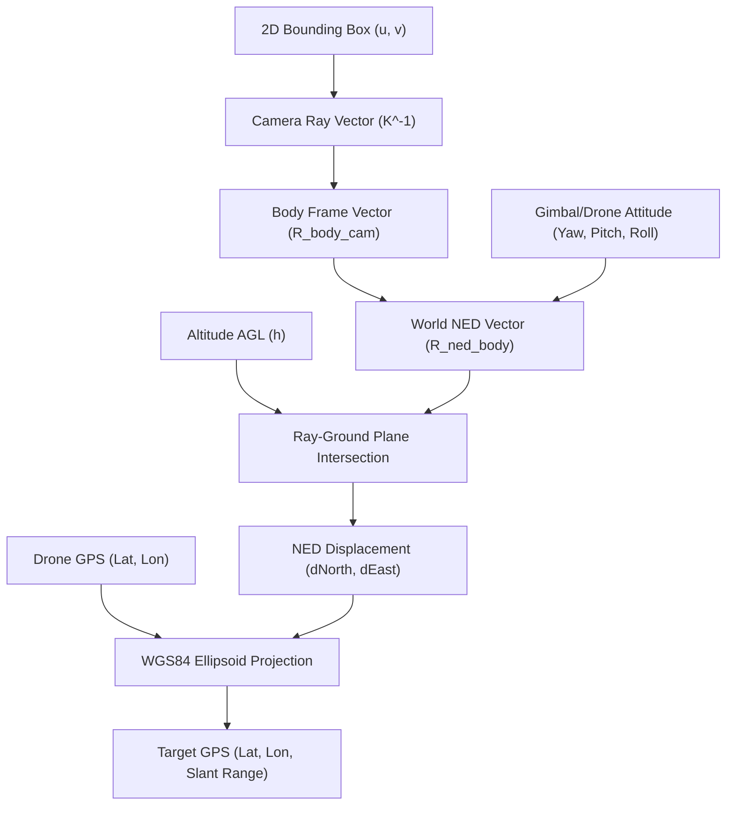

# Direct Georeferencing & Target Geolocation for Drone Vision

## 1. Executive Summary

In aerial computer vision and autonomous unmanned aerial vehicle (UAV) systems, calculating the real-world geographic coordinates (Latitude, Longitude, Altitude) of detected objects (e.g., humans detected via YOLO) from monocular camera feeds is known as **Direct Georeferencing**, **Monocular Target Geolocation**, or **Terrain Raycasting**.

This document outlines:
1. The mathematical pipeline for transforming 2D pixel coordinates into 3D geodetic WGS84 positions.
2. Proven open-source implementations, libraries, and communication protocols.
3. Edge deployment considerations for companion computers (such as the Raspberry Pi 5).
4. A production-ready Python reference implementation with zero heavy dependencies.

---

## 2. Core Mathematical Pipeline

The geolocation pipeline operates through sequential coordinate frame transformations:



### Coordinate Frames

1. **Image Plane $\mathbf{(u, v)}$**: Pixel space where $u \in [0, W]$ and $v \in [0, H]$.
2. **Camera Optical Frame $\mathbf{(X_c, Y_c, Z_c)}$**: Standard pinhole convention:
   - $X_c$: Points horizontally right across image columns.
   - $Y_c$: Points vertically down across image rows.
   - $Z_c$: Optical axis pointing forward into the scene.
3. **Drone Body Frame $\mathbf{(X_b, Y_b, Z_b)}$**: Aerospace Forward-Right-Down (FRD) convention:
   - $X_b$: Forward along the aircraft nose.
   - $Y_b$: Right along the starboard wing.
   - $Z_b$: Downward through the belly.
4. **Local Tangent World Frame $\mathbf{(NED)}$**:
   - North-East-Down coordinate system centered at the drone's position.
5. **Global Geodetic Frame $\mathbf{(WGS84)}$**:
   - Geocentric reference model (Latitude $\phi$, Longitude $\lambda$, Ellipsoidal Height $h$).

---

### Step-by-Step Mathematical Derivations

#### 1. Pixel to Camera Frame Unit Ray
Given camera intrinsic matrix $K$:
$$K = \begin{bmatrix} f_x & 0 & c_x \\ 0 & f_y & c_y \\ 0 & 0 & 1 \end{bmatrix}$$
The normalized unit ray in the camera frame is:
$$\mathbf{r}_c = \frac{K^{-1} \begin{bmatrix} u \\ v \\ 1 \end{bmatrix}}{\left\| K^{-1} \begin{bmatrix} u \\ v \\ 1 \end{bmatrix} \right\|} = \frac{1}{\sqrt{x_c^2 + y_c^2 + 1}} \begin{bmatrix} (u - c_x)/f_x \\ (v - c_y)/f_y \\ 1 \end{bmatrix}$$

#### 2. Camera Frame to Drone Body Frame
When a camera is rigidly mounted facing forward horizontally:
$$\begin{bmatrix} X_b \\ Y_b \\ Z_b \end{bmatrix} = R_{body \leftarrow cam} \begin{bmatrix} X_c \\ Y_c \\ Z_c \end{bmatrix} = \begin{bmatrix} 0 & 0 & 1 \\ 1 & 0 & 0 \\ 0 & 1 & 0 \end{bmatrix} \begin{bmatrix} X_c \\ Y_c \\ Z_c \end{bmatrix}$$

#### 3. Body Frame to Local World Frame (NED)
Given drone attitude Euler angles (Yaw $\psi$, Pitch $\theta$, Roll $\phi$):
$$R_{NED \leftarrow body} = R_z(\psi) R_y(\theta) R_x(\phi)$$
- $R_z(\psi)$: Yaw / Heading rotation around Down axis (clockwise from True North).
- $R_y(\theta)$: Pitch rotation around East axis (nose up / down).
- $R_x(\phi)$: Roll rotation around North axis (right wing down).

The ray vector in the NED world frame is:
$$\mathbf{r}_{NED} = R_{NED \leftarrow body} \cdot R_{body \leftarrow cam} \cdot \mathbf{r}_c = \begin{bmatrix} r_N \\ r_E \\ r_D \end{bmatrix}$$

#### 4. Ray-Ground Intersection
For drone altitude above ground level $h = \text{alt}_{drone} - \text{alt}_{ground}$:
- If $r_D \le 0$, the ray points towards or above the horizon (no ground intersection).
- If $r_D > 0$, the scale factor $s$ to the ground plane ($Z_{NED} = h$) is:
$$s = \frac{h}{r_D}$$
The local Cartesian offsets in meters are:
$$\Delta \text{North} = s \cdot r_N$$
$$\Delta \text{East} = s \cdot r_E$$
The total slant range from drone to target is:
$$R_{slant} = s \cdot \|\mathbf{r}_{NED}\| = \frac{h}{r_D}$$

#### 5. Local NED Offset to WGS84 Geodetic Coordinates
Using the WGS84 Earth equatorial radius ($R_E \approx 6,378,137\text{ m}$):
$$\text{Lat}_{target} = \text{Lat}_{drone} + \left(\frac{\Delta \text{North}}{R_E}\right) \times \frac{180}{\pi}$$
$$\text{Lon}_{target} = \text{Lon}_{drone} + \left(\frac{\Delta \text{East}}{R_E \cos(\text{Lat}_{drone})}\right) \times \frac{180}{\pi}$$

---

## 3. Notable Existing Implementations & Repositories

| Repository | Organization / Author | Description |
| :--- | :--- | :--- |
| [rgerum/cameratransform](https://github.com/rgerum/cameratransform) | R. Gerum (*SoftwareX*, 2019) | Dedicated Python package for camera projection, spatial orientation (`elevation_m`, `heading_deg`, `tilt_deg`, `roll_deg`), and direct GPS transformation (`cam.gpsFromImage([u, v])`). |
| [Theta-Limited/OpenAthena-Legacy-Python](https://github.com/Theta-Limited/OpenAthena-Legacy-Python) | Theta Informatics | Open-source core of OpenAthena. Ray-casts camera vectors against Digital Elevation Models (DEMs) to pinpoint ground targets from drone EXIF/telemetry. |
| [DLR-MI/pix2geo](https://github.com/DLR-MI/pix2geo) | German Aerospace Center (DLR) | Fast Python library for georeferencing image pixels using raycasting and homography transformations. |
| [rfonod/geo-trax](https://github.com/rfonod/geo-trax) | R. Fonod | Complete aerial tracking pipeline combining YOLO object detection, video stabilization, and direct georeferencing. |
| [bambi-eco/bambi_detection](https://github.com/bambi-eco/bambi_detection) | BAMBI Eco-Project | Wildlife detection using drone vision with DEM-backed bounding box georeferencing. |
| [geospace-code/pymap3d](https://github.com/geospace-code/pymap3d) | Geospace Code | High-performance, pure-Python 3D coordinate transformation library (NED $\leftrightarrow$ ECEF $\leftrightarrow$ WGS84). |

---

## 4. Telemetry Standards & Integration Protocols

### MAVLink v2 Camera Tracking Protocol
When integrating with ArduPilot or PX4 autopilots over MAVLink:
- **`CAMERA_TRACKING_IMAGE_STATUS` (ID 275)**: Transmits normalized 2D bounding boxes $(x, y, w, h)$ or tracked point coordinates.
- **`CAMERA_TRACKING_GEO_STATUS` (ID 276)**: Transmits calculated 3D target coordinates (`lat`, `lon`, `alt`), velocities (`vel_n`, `vel_e`, `vel_d`), and estimated target location accuracy.

### Commercial Gimbal Protocols
- **ViewPro TargetPosCalculateProtocol**: Industrial gimbals (e.g., ViewPro Q30T) ingest drone telemetry over serial and compute target GPS positions internally using onboard optical encoders and laser rangefinders.

---

## 5. Engineering Pitfalls & Best Practices

1. **Bounding Box Reference Point Selection**:
   - For standing or walking humans, **always project the bottom-center** of the bounding box:
     $$u = \frac{x_{min} + x_{max}}{2}, \quad v = y_{max}$$
   - Projecting the bounding box centroid $(x_{mid}, y_{mid})$ assumes the person's center of mass lies on the ground plane, producing an artificial 2 to 6 meter overshoot at oblique camera angles.
2. **Telemetry Synchronization & Latency**:
   - Drone GPS and IMU update at 10–50 Hz, while video captures at 30–60 FPS. At a modest yaw rate of $30^\circ/\text{s}$, a 100 ms telemetry offset introduces a $3^\circ$ heading error, causing a 5-meter positioning error at a 100-meter slant range. Telemetry must be linearly interpolated to match video frame capture timestamps.
3. **Flat-Earth Assumption vs. Terrain Elevation (DEM)**:
   - Assuming a flat ground plane works well over water, agricultural fields, or low-altitude flights (<30 m). In hilly terrain, camera rays must be marched against a Digital Elevation Model (such as 30-meter SRTM or 10-meter Copernicus DEM tiles).
4. **Gimbal Mode Accounting**:
   - **Follow Mode**: Gimbal yaw is relative to drone heading ($\psi_{cam} = \psi_{drone} + \psi_{gimbal}$).
   - **Lock / Earth Frame Mode**: Gimbal yaw is stabilized to True North ($\psi_{cam} = \psi_{gimbal}$).
5. **Temporal Filtering**:
   - Raw bounding box detections exhibit high-frequency jitter. Passing calculated $(Lat, Lon)$ through an Extended Kalman Filter (EKF) smooths the coordinate trajectory and enables target velocity estimation.

---

## 6. Standalone Python Reference Implementation

A lightweight, zero-dependency implementation compatible with Raspberry Pi 5:

```python
import numpy as np

class DroneTargetGeolocator:
    """
    Direct georeferencing engine for aerial drone object detection.
    Converts image pixel coordinates to WGS84 GPS coordinates using real-time telemetry.
    """

    def __init__(self, img_w: int, img_h: int, hfov_deg: float):
        self.img_w = img_w
        self.img_h = img_h
        
        # Compute focal length from horizontal FOV
        fx = (img_w / 2.0) / np.tan(np.radians(hfov_deg / 2.0))
        fy = fx
        cx = img_w / 2.0
        cy = img_h / 2.0
        
        self.K_inv = np.linalg.inv(np.array([
            [fx,  0, cx],
            [ 0, fy, cy],
            [ 0,  0,  1]
        ]))

        # Camera frame (x: right, y: down, z: forward)
        # to Drone Body frame (x: forward, y: right, z: down)
        self.R_body_cam = np.array([
            [0, 0, 1],
            [1, 0, 0],
            [0, 1, 0]
        ])

    def _euler_to_rotation_matrix(self, yaw_deg: float, pitch_deg: float, roll_deg: float) -> np.ndarray:
        """ZYX rotation matrix transforming Body coordinates to NED."""
        psi = np.radians(yaw_deg)      # Heading / Yaw (0 = North, 90 = East)
        theta = np.radians(pitch_deg)  # Pitch (-90 = Nadir pointing straight down)
        phi = np.radians(roll_deg)     # Roll

        Rz = np.array([
            [np.cos(psi), -np.sin(psi), 0],
            [np.sin(psi),  np.cos(psi), 0],
            [0,            0,           1]
        ])
        Ry = np.array([
            [ np.cos(theta), 0, np.sin(theta)],
            [ 0,             1, 0           ],
            [-np.sin(theta), 0, np.cos(theta)]
        ])
        Rx = np.array([
            [1, 0,            0          ],
            [0, np.cos(phi), -np.sin(phi)],
            [0, np.sin(phi),  np.cos(phi)]
        ])
        return Rz @ Ry @ Rx

    def pixel_to_gps(
        self,
        u: float,
        v: float,
        drone_lat: float,
        drone_lon: float,
        drone_alt_agl: float,
        yaw_deg: float,
        pitch_deg: float,
        roll_deg: float = 0.0
    ):
        """
        Geotags a pixel (u, v) to (latitude, longitude, slant_range_m).
        Returns None if the ray points above the horizon.
        """
        # 1. Pixel to camera unit ray
        pixel_h = np.array([u, v, 1.0])
        ray_cam = self.K_inv @ pixel_h
        ray_cam /= np.linalg.norm(ray_cam)

        # 2. Camera ray to NED frame
        R_ned_body = self._euler_to_rotation_matrix(yaw_deg, pitch_deg, roll_deg)
        R_ned_cam = R_ned_body @ self.R_body_cam
        ray_ned = R_ned_cam @ ray_cam

        # 3. Check for ground intersection (Down component must be positive)
        if ray_ned[2] <= 1e-4:
            return None

        # 4. Ray-ground plane intersection
        scale = drone_alt_agl / ray_ned[2]
        delta_north = scale * ray_ned[0]
        delta_east = scale * ray_ned[1]
        slant_range = scale * np.linalg.norm(ray_ned)

        # 5. Local NED displacement to WGS84 geodetic
        r_earth = 6378137.0  # Earth equatorial radius (meters)
        d_lat = (delta_north / r_earth) * (180.0 / np.pi)
        d_lon = (delta_east / (r_earth * np.cos(np.radians(drone_lat)))) * (180.0 / np.pi)

        return {
            "target_lat": drone_lat + d_lat,
            "target_lon": drone_lon + d_lon,
            "slant_range_m": slant_range,
            "offset_north_m": delta_north,
            "offset_east_m": delta_east
        }
```
